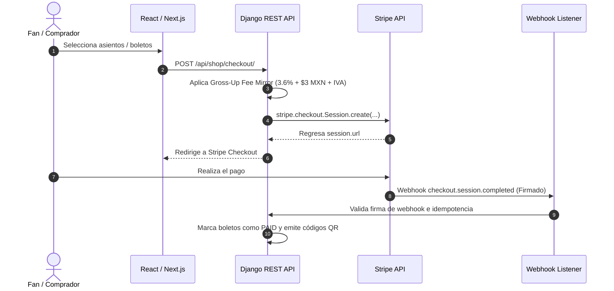
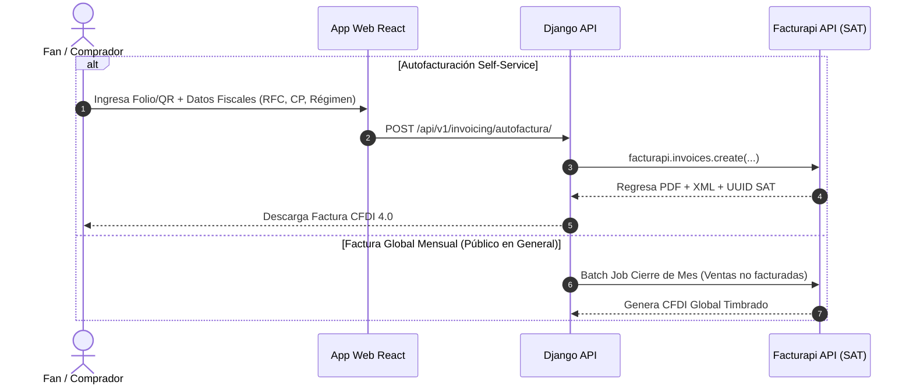

# 🛠️ MS AMBAR — Guía Técnica para Desarrolladores & Arquitectura del Motor de Taquilla, Pagos e Impuestos

[](https://nextjs.org/)
[](https://www.typescriptlang.org/)
[](https://www.django-rest-framework.org/)
[](https://www.postgresql.org/)
[](https://stripe.com/)
[](https://www.facturapi.io/)

```
   __/\__
  \      /    MS AMBAR — TAQUILLA DIGITAL, PROCESAMIENTO STRIPE & FACTURACIÓN SAT
  /_  _  _\   Documentación Técnica de Ingeniería (Nectar Labs Architecture)
    \/
```

---

## 📋 Índice de Contenidos

1. [📌 Visión General del Sistema](#-visión-general-del-sistema)
2. [⚡ 1. Arquitectura de Integración con Stripe API](#-1-arquitectura-de-integración-con-stripe-api)
3. [💳 2. Mecanismo Numérico de Comisiones Stripe MX (`Stripe Fee Mirror`)](#-2-mecanismo-numérico-de-comisiones-stripe-mx-stripe-fee-mirror)
4. [📊 3. Ejemplo Práctico y Análisis de Venta Real ($1,100.00 MXN Base)](#-3-ejemplo-práctico-y-análisis-de-venta-real-110000-mxn-base)
5. [🏛️ 4. Diagnóstico del Manejo de Impuestos en Configuración Default](#-4-diagnóstico-del-manejo-de-impuestos-en-configuración-default)
6. [📜 5. Blueprint de Integración con Facturapi (SAT CFDI 4.0)](#-5-blueprint-de-integración-con-facturapi-sat-cfdi-40)
7. [🧮 6. Motor de Precios Dinámicos (`Dynamic Pricing Engine`)](#-6-motor-de-precios-dinámicos-dynamic-pricing-engine)
8. [🎨 7. Arquitectura del Motor de Tematización (`Theme Customization Engine`)](#-7-arquitectura-del-motor-de-tematización-theme-customization-engine)
9. [⚡ 8. Motor de Partículas & Rendimiento Canvas 60 FPS](#-8-motor-de-partículas--rendimiento-canvas-60-fps)
10. [📧 9. Motor de Notificaciones & Failover SMTP Multicanal](#-9-motor-de-notificaciones--failover-smtp-multicanal)
11. [🗄️ 10. Modelos Principales de Base de Datos](#-10-modelos-principales-de-base-de-datos)
12. [🛠️ 11. Comandos de Mantenimiento & Suite de Pruebas](#-11-comandos-de-mantenimiento--suite-de-pruebas)
13. [📂 12. Archivos Clave del Código](#-12-archivos-clave-del-código)

---

## 📌 Visión General del Sistema

El módulo de taquilla digital de **MS AMBAR** implementa:
- Motor de cálculo dinámico de precios anticipados (*Early Bird*) con suelo de protección.
- Selección interactiva de asientos numerados en mapas vectoriales SVG/Canvas.
- Integración con **Stripe Checkout Sessions** y webhooks criptográficamente firmados.
- Cálculo exacto de recargos por comisiones bancarias (*Gross-Up Fee Mirror*).
- Integración para **Facturación Electrónica SAT (CFDI 4.0)** mediante **Facturapi**.
- Sistema dinámico de personalización visual por sección alimentado por el modelo Singleton `SiteSettings`.

---

## ⚡ 1. Arquitectura de Integración con Stripe API

El flujo de pago en MS AMBAR se ejecuta mediante sesiones alojadas de Stripe (`Stripe Checkout Sessions`) para garantizar cumplimiento estricto de PCI-DSS Nivel 1 sin almacenar tarjetas en servidores propios.

### A. Flujo de Creación de Sesión (`backend/apps/shop/utils.py`)



### B. Garantía Anti-Ventas Rechazadas (Prevención de Registro de Fallos)

> [!IMPORTANT]
> **Regla de Oro de Integridad Financiera**: Las transacciones no exitosas o rechazadas por Stripe **NUNCA** se registran como ventas en la base de datos de MS AMBAR.

- **Creación en Estado Pendiente**: Al iniciar el checkout, los boletos no existen con estado `paid`. Solamente se registran como reservas temporales no confirmadas (`status='pending'`).
- **Confirmación Estricta por Webhook Firmado**: El backend únicamente convierte una transacción en venta válida (`status='paid'`) cuando recibe y valida un evento webhook firmado criptográficamente por Stripe:
  - Evento `checkout.session.completed` (con `payment_status == 'paid'`).
  - Evento `payment_intent.succeeded`.
- **Manejo de Transacciones Fallidas o Incompletas**:
  - Si el pago es rechazado por el banco emisor (`payment_intent.payment_failed`), si la sesión expira (`checkout.session.expired`), o si el usuario cancela la operación en la pasarela, Stripe **NO** emite el evento de completado.
  - El sistema ignora o cancela la reserva temporal, liberando inmediatamente los asientos numerados para otros compradores.
  - **Idempotencia Garantizada**: Cada evento se registra en la tabla `StripeEvent` mediante su `event_id` único para prevenir doble procesamiento en caso de reintentos de red.

---

## 💳 2. Mecanismo Numérico de Comisiones Stripe MX (`Stripe Fee Mirror`)

Para asegurar que la taquilla o el artista reciba el **100% del precio base** configurado para cada boleto, MS AMBAR aplica la fórmula matemática de **Gross-Up / Recargo de Servicio** en el backend ([`fees.py`](file:///c:/Users/Agent/OneDrive/Documents/proyects/ms-ambar/backend/apps/tickets/fees.py)) y en el frontend ([`comprar-boletos.tsx`](file:///c:/Users/Agent/OneDrive/Documents/proyects/ms-ambar/frontend/src/pages/comprar-boletos.tsx)).

### A. Tarifas Estándar Stripe en México

- **Tarjeta Nacional (México)**: 3.6% + $3.00 MXN base.
- **Tarjeta Internacional / Adaptive Pricing (USD / Extranjero)**: 4.4% + $3.00 MXN base.
- **Impuesto sobre la Comisión de Stripe**: Stripe México cobra e incluye **16% de IVA sobre su propia comisión bancaria**.

#### Tasas Efectivas de Retención Stripe (Comisión + IVA):
- **Nacional Efectiva**: $(3.6\% \times 1.16) = \mathbf{4.176\%}$ y $(\$3.00 \times 1.16) = \mathbf{\$3.48 \text{ MXN}}$
- **Internacional Efectiva**: $(4.4\% \times 1.16) = \mathbf{5.104\%}$ y $(\$3.00 \times 1.16) = \mathbf{\$3.48 \text{ MXN}}$

### B. Fórmulas Matemáticas de Recargo (Gross-Up)

$$total_{\text{nacional}} = \frac{\text{precio\_base} + 3.48}{1 - 0.04176} = \frac{\text{precio\_base} + 3.48}{0.95824}$$

$$total_{\text{internacional}} = \frac{\text{precio\_base} + 3.48}{1 - 0.05104} = \frac{\text{precio\_base} + 3.48}{0.94896}$$

$$\text{cargo\_servicio} = total - \text{precio\_base}$$

---

## 📊 3. Ejemplo Práctico y Análisis de Venta Real ($1,100.00 MXN Base)

### Caso de Estudio: Venta Real (2 Boletos + 2 Upgrades M&G = $1,100.00 MXN Base)

#### 1. Para Tarjetas Nacionales México ($1,100 MXN base):
$$total = \frac{1100 + 3.48}{0.95824} = \mathbf{\$1,151.57 \text{ MXN}}$$
- Cargo de servicio exhibido al fan: **$51.57 MXN**
- Deducción total de Stripe (3.6% + $3.00 MXN + 16% IVA): **$51.57 MXN**
- **Depósito Neto al Comercio**: $\$1,151.57 - \$51.57 = \mathbf{\$1,100.00 \text{ MXN EXACTOS}}$

#### 2. Para Tarjetas Internacionales / Adaptive Pricing USD ($1,100 MXN base):
$$total = \frac{1100 + 3.48}{0.94896} = \mathbf{\$1,162.83 \text{ MXN}}$$
- Cargo de servicio exhibido al fan: **$62.83 MXN**
- Deducción total de Stripe (4.4% + $3.00 MXN + 16% IVA + FX): **$62.83 MXN**
- **Depósito Neto al Comercio**: $\$1,162.83 - \$62.83 = \mathbf{\$1,100.00 \text{ MXN EXACTOS}}$

---

## 🏛️ 4. Diagnóstico del Manejo de Impuestos en Configuración Default

Por defecto, la API estándar de Stripe **NO** retiene ni desglosa los impuestos locales (IVA/ISR) de las ventas de boletos hacia el fisco mexicano (SAT). Únicamente emite una factura fiscal por las comisiones que Stripe cobra al negocio.

### Estrategias para Abordar los Impuestos en MS AMBAR:

1. **Estrategia A: Precios con IVA Incluido (Estándar B2C en México - Recomendada)**:
   - Los precios exhibidos al cliente ($300, $500, etc.) ya incluyen el 16% de IVA.
   - Simplifica el checkout y cumple con la Ley Federal de Protección al Consumidor (PROFECO).
2. **Estrategia B: Stripe Tax API**:
   - Cálculo automático de impuestos en el Checkout de Stripe según la geolocalización del comprador.
3. **Estrategia C: Facturación Electrónica SAT (CFDI 4.0) mediante Facturapi**:
   - Integración nativa para la emisión automática de facturas fiscales timbradas por un PAC en México.

---

## 📜 5. Blueprint de Integración con Facturapi (SAT CFDI 4.0)

**Facturapi** es una API REST especializada en facturación electrónica para México que permite timbrar comprobantes CFDI 4.0, gestionar autofacturación para usuarios finales y generar la Factura Global diaria/mensual exigida por el SAT.



---

## 🧮 6. Motor de Precios Dinámicos (`Dynamic Pricing Engine`)

El sistema incluye un algoritmo de **Aumento Progresivo de Precios** previo al evento regulado por reglas de seguridad y suelos de descuento.

### A. Fórmulas de Cálculo Backend (`backend/apps/tickets/models.py`)

$$\text{meses\_diff} = \text{mes\_evento} - \text{mes\_compra}$$

- **$\text{meses\_diff} \ge 2$ (ej. Agosto o antes para evento en Octubre)**: $\text{precio\_final} = \text{precio\_base}$ (0 incrementos).
- **$\text{meses\_diff} = 1$ (Septiembre)**: $\text{precio\_final} = \text{precio\_base} + (1 \times \text{incremento})$.
- **$\text{meses\_diff} \le 0$ (Mes del evento)**: $\text{precio\_final} = \text{precio\_base} + (2 \times \text{incremento})$.

### B. Reglas de Seguridad Anti-Cero (Price Floor Safety)

- **Tope de Descuento (30%)**: El descuento total por venta anticipada jamás puede superar el 30% del valor base nominal del boleto.
- **Precio Piso Mínimo (70%)**: La entrada garantiza un precio mínimo cobrable equivalente al 70% de su valor base.

---

## 🎨 7. Arquitectura del Motor de Tematización (`Theme Customization Engine`)

El sistema de temas visuales se gobierna desde el backend Django mediante el modelo Singleton `SiteSettings` en [`backend/apps/tickets/models.py`](file:///c:/Users/Agent/OneDrive/Documents/proyects/ms-ambar/backend/apps/tickets/models.py):

- **Modelo Singleton**: Garantiza `pk=1` en el método `save()`.
- **Inyección CSS por Sección**: Componente React `<ThemedSection>` inyecta variables CSS aisladas (`--sec-[key]-bg`, `--sec-[key]-accent`) sin contaminar el alcance global.
- **Context API React**: `EventThemeContext` sincroniza el estado visual consumiendo el endpoint `/api/tickets/theme/`.

---

## ⚡ 8. Motor de Partículas & Rendimiento Canvas 60 FPS

El componente [`CanvasParticles.tsx`](file:///c:/Users/Agent/OneDrive/Documents/proyects/ms-ambar/frontend/src/components/CanvasParticles.tsx) garantiza 60 FPS continuos mediante:
1. **`requestAnimationFrame` + `cancelAnimationFrame`** en la fase de desmontaje.
2. **Device Pixel Ratio Capping**: `Math.min(rawDpr, isMobile ? 1.25 : 2.0)`.
3. **Densidad Adaptativa**: Reducción al 35% en dispositivos móviles.
4. **Path Batching**: Dibujado en solo 2 pasadas (`beginPath` + `fill`).
5. **Limpieza de Sombras**: Reseteo explícito de `shadowBlur = 0` y `shadowColor = 'transparent'`.
6. **Optimización O(N²)**: Verificación de distancias al cuadrado (`distSq < 14400`) deshabilitada en pantallas móviles.

---

## 📧 9. Motor de Notificaciones & Failover SMTP Multicanal

El motor de newsletter y correos transaccionales en [`backend/apps/blog/test_failover_backend.py`](file:///c:/Users/Agent/OneDrive/Documents/proyects/ms-ambar/backend/apps/blog/test_failover_backend.py) implementa failover multicanal:

1. **Canal Primario**: Brevo SMTP API (hasta agotar cuota diaria).
2. **Canal Secundario**: Amazon SES SMTP (remitente `hola@msambar.com`).
3. **Canal Fallback**: Zoho Mail SMTP.
4. **Desuscripción Segura**: Redirección con parámetro `?unsubscribe=email` que dispara una petición `POST` al endpoint de desuscripción.

---

## 🗄️ 10. Modelos Principales de Base de Datos

1. **`Event`**: Configuración del espectáculo, precios base, incrementos y límites de pases.
2. **`Theater`**: Diagrama JSON interactivo de mesas y asientos.
3. **`Seat`**: Butaca numerada con referencia a zona y precio específico.
4. **`Ticket`**: Registro con token único de acceso, código QR, estado de pago (`pending`, `paid`, `cancelled`) y referencia de Stripe Session.
5. **`SiteSettings`**: Configuración global de tema, biografía y comisiones (Singleton `pk=1`).

---

## 🛠️ 11. Comandos de Mantenimiento & Suite de Pruebas

```bash
# Ejecutar Migraciones en Django
python backend/manage.py migrate

# Sembrar datos iniciales y sanitizar precios
python backend/seed_db.py

# Ejecutar Suite de Pruebas Backend
python backend/manage.py test apps.tickets apps.shop apps.blog.test_failover_backend

# Ejecutar Pruebas Frontend con Jest
cd frontend && npm test
```

---

## 📂 12. Archivos Clave del Código

- [`fees.py`](file:///c:/Users/Agent/OneDrive/Documents/proyects/ms-ambar/backend/apps/tickets/fees.py): Fórmula Gross-Up de comisión Stripe MX.
- [`models.py`](file:///c:/Users/Agent/OneDrive/Documents/proyects/ms-ambar/backend/apps/tickets/models.py): Algoritmo de precios dinámicos y modelo Singleton `SiteSettings`.
- [`views.py`](file:///c:/Users/Agent/OneDrive/Documents/proyects/ms-ambar/backend/apps/shop/views.py): Handlers de Webhooks de Stripe con verificación de firma e idempotencia.
- [`utils.py`](file:///c:/Users/Agent/OneDrive/Documents/proyects/ms-ambar/backend/apps/shop/utils.py): Creación de Checkout Sessions de Stripe.
- [`CanvasParticles.tsx`](file:///c:/Users/Agent/OneDrive/Documents/proyects/ms-ambar/frontend/src/components/CanvasParticles.tsx): Renderizado optimizado a 60 FPS en HTML5 Canvas.
- [`ThemedSection.tsx`](file:///c:/Users/Agent/OneDrive/Documents/proyects/ms-ambar/frontend/src/components/ThemedSection.tsx): Aislamiento dinámico de variables CSS Custom Properties.
- [`musica.tsx`](file:///c:/Users/Agent/OneDrive/Documents/proyects/ms-ambar/frontend/src/pages/musica.tsx): Reproductores de audio desacoplados y resiliencia de iframes con `IframeErrorBoundary`.

---

<p center align="center">
  <b>MS AMBAR Developer Documentation</b> • Desarrollado por <b>Nectar Labs</b> © 2026
</p>
