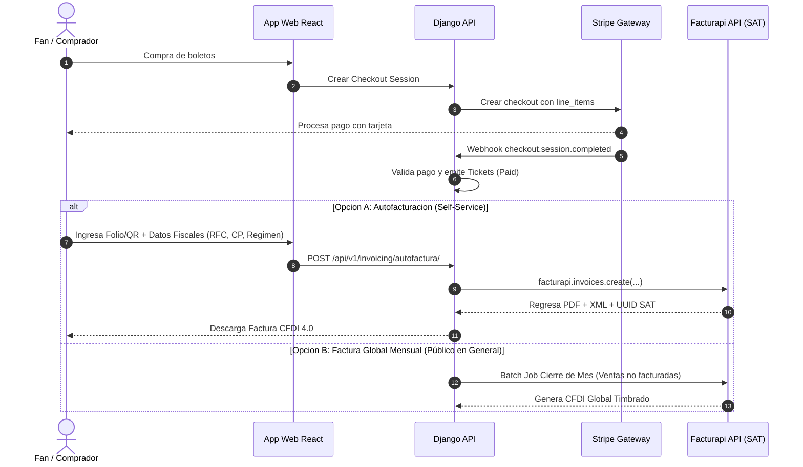

# MS AMBAR — Guía Técnica para Desarrolladores & Arquitectura del Motor de Taquilla, Pagos e Impuestos

```
   __/\__
  \      /    MS AMBAR — TAQUILLA DIGITAL, PROCESAMIENTO STRIPE & FACTURACIÓN SAT
  /_  _  _\   Documentación Técnica de Ingeniería (Nectar Labs Architecture)
    \/
```

---

## 📌 Visión General del Sistema

El módulo de taquilla digital de **MS AMBAR** implementa un motor de cálculo dinámico de precios, reservas de asientos numerados en mapas interactivos 2D (mesas x butacas), compra de entradas generales sin asiento, pasarelas de pago seguras mediante **Stripe API** (Checkout Sessions & Webhooks) y un diseño de arquitectura para **Facturación Electrónica SAT (CFDI 4.0)** mediante **Facturapi**.

---

## ⚡ 1. Arquitectura de Integración con Stripe API

El flujo de pago en MS AMBAR se ejecuta mediante sesiones alojadas de Stripe (`Stripe Checkout Sessions`) para garantizar cumplimiento estricto de PCI-DSS nivel 1 sin almacenar tarjetas en servidores propios.

### A. Flujo de Creación de Sesión (`backend/apps/shop/utils.py`)
1. El cliente selecciona sus boletos/asientos en el frontend React.
2. El backend invoca `create_ticket_checkout_session()` para armar los ítems de compra (`line_items`), aplicando precios base dinámicos, cupones de descuento y el recargo automático por **Cargo de Servicio Stripe**.
3. Se retorna la `session_url` de Stripe Checkout para redirigir al comprador.

### B. Garantía Anti-Ventas Rechazadas (Prevención de Registro de Fallos)
> [!IMPORTANT]
> **Regla de Oro de Integridad Financiera**: Las transacciones no exitosas o rechazadas por Stripe **NUNCA** se registran como ventas en la base de datos de MS AMBAR.

- **Creación en Estado Pendiente**: Al iniciar el checkout, los boletos no existen con estado `paid`. Solamente se registran como reservas temporales no confirmadas o no se persisten hasta recibir la notificación oficial bancaria.
- **Confirmación Estricta por Webhook Firmado**: El backend únicamente convierte una transacción en venta válida (`status='paid'`) cuando recibe y valida un evento webhook firmado criptográficamente por Stripe:
  - Evento `checkout.session.completed` (con `payment_status == 'paid'`).
  - Evento `payment_intent.succeeded`.
- **Manejo de Transacciones Fallidas o Incompletas**:
  - Si el pago es rechazado por el banco emisor (`payment_intent.payment_failed`), si la sesión expira (`checkout.session.expired`), o si el usuario cancela la operación en la pasarela, Stripe **NO** emite el evento de completado.
  - El sistema ignora o cancela la reserva temporal, liberando inmediatamente los asientos numerados para otros compradores.
  - **Idempotencia Garantizada**: Cada evento se registra en la tabla `StripeEvent` mediante su `event_id` único para prevenir doble procesamiento en caso de reintentos de red.

---

## 💳 2. Mecanismo Numérico de Comisiones Stripe MX (`Stripe Fee Mirror`)

Para asegurar que la taquilla o el artista reciba el **100% del precio base** configurado para cada boleto, MS AMBAR aplica la fórmula matemática de **Gross-Up / Recargo de Servicio** en el backend ([fees.py](file:///c:/Users/Agent/OneDrive/Documents/proyects/ms-ambar/backend/apps/tickets/fees.py)) y en el frontend ([comprar-boletos.tsx](file:///c:/Users/Agent/OneDrive/Documents/proyects/ms-ambar/frontend/src/pages/comprar-boletos.tsx)).

### A. Tarifas Estándar Stripe en México
- **Comisión Variable**: 3.6% sobre el monto total procesado.
- **Comisión Fija**: $3.00 MXN por transacción exitosa.
- **Impuesto sobre la Comisión**: Stripe traslada el **16% de IVA sobre su propia comisión bancaria** al comercio.

## 💳 2. Mecanismo Numérico de Comisiones Stripe MX (`Stripe Fee Mirror`)

Para asegurar que la taquilla o el artista reciba el **100% del precio base** configurado para cada boleto, MS AMBAR aplica la fórmula matemática de **Gross-Up / Recargo de Servicio** en el backend ([fees.py](file:///c:/Users/Agent/OneDrive/Documents/proyects/ms-ambar/backend/apps/tickets/fees.py)) y en el frontend ([comprar-boletos.tsx](file:///c:/Users/Agent/OneDrive/Documents/proyects/ms-ambar/frontend/src/pages/comprar-boletos.tsx)).

### A. Tarifas Estándar Stripe en México
- **Tarjeta Nacional (México)**: 3.6% + $3.00 MXN base.
- **Tarjeta Internacional / Adaptive Pricing (USD / Extranjero)**: 4.4% + $3.00 MXN base.
- **Impuesto sobre la Comisión de Stripe**: Stripe México cobra e incluye **16% de IVA sobre su propia comisión bancaria**.

#### Tasas Efectivas de Retención Stripe (Comisión + IVA):
- **Nacional Efectiva**: $(3.6\% \times 1.16) = \mathbf{4.176\%}$ y $(\$3.00 \times 1.16) = \mathbf{\$3.48 \text{ MXN}}$
- **Internacional Efectiva**: $(4.4\% \times 1.16) = \mathbf{5.104\%}$ y $(\$3.00 \times 1.16) = \mathbf{\$3.48 \text{ MXN}}$

### B. Fórmulas Matemáticas de Recargo (Gross-Up)

$$total_{\text{nacional}} = \frac{\text{precio\_base} + 3.48}{1 - 0.04176} = \frac{\text{precio\_base} + 3.48}{0.95824}$$

$$total_{\text{internacional}} = \frac{\text{precio\_base} + 3.48}{1 - 0.05104} = \frac{\text{precio\_base} + 3.48}{0.94896}$$

$$\text{cargo\_servicio} = total - \text{precio\_base}$$

---

## 📊 3. Ejemplo Práctico y Análisis de Venta Real ($1,100.00 MXN Base)

### Caso de Estudio: Venta Real con Tarjeta Internacional (Stacy Téllez / EE.UU.)

#### ❌ Diagnóstico de la Fórmula Anterior (Sin IVA en Comisión / Sin Tarifa Internacional):
En una compra de 2 boletos ($400 c/u) + 2 upgrades M&G ($150 c/u) = **$1,100.00 MXN base**:
- La fórmula anterior usaba $(1100 + 3) / (1 - 0.036) = \mathbf{\$1,144.19 \text{ MXN}}$ (cargo de servicio $44.19 MXN).
- Al pagar desde EE.UU. en USD (Adaptive Pricing), Stripe dedujo:
  - Comisión procesadora: **$49.91 MXN**
  - 16% IVA sobre la comisión: **$7.99 MXN**
  - Deducción total de Stripe: **$57.90 MXN**
- **Resultado en depósito neto**: $\$1,144.19 - \$57.90 = \mathbf{\$1,086.29 \text{ MXN}}$ *(Faltaban $13.71 MXN para completar los $1,100 exactos)*.

#### ✅ Solución con la Nueva Fórmula de Recargo Exacto:

1. **Para Tarjetas Nacionales México ($1,100 MXN base)**:
   $$total = \frac{1100 + 3.48}{0.95824} = \mathbf{\$1,151.57 \text{ MXN}}$$
   - Cargo de servicio exhibido al fan: **$51.57 MXN**
   - Deducción total de Stripe (3.6% + $3.00 MXN + 16% IVA): **$51.57 MXN**
   - **Depósito Neto al Comercio**: $\$1,151.57 - \$51.57 = \mathbf{\$1,100.00 \text{ MXN EXACTOS}}$

2. **Para Tarjetas Internacionales / Adaptive Pricing USD ($1,100 MXN base)**:
   $$total = \frac{1100 + 3.48}{0.94896} = \mathbf{\$1,162.83 \text{ MXN}}$$
   - Cargo de servicio exhibido al fan: **$62.83 MXN**
   - Deducción total de Stripe (4.4% + $3.00 MXN + 16% IVA + FX): **$62.83 MXN**
   - **Depósito Neto al Comercio**: $\$1,162.83 - \$62.83 = \mathbf{\$1,100.00 \text{ MXN EXACTOS}}$

---

### 📋 Cuadro Resumen de Impuestos y Deducciones en Transacciones

| Capa Fiscal / Impuesto | Concepto | Tratamiento en la Venta | Responsable |
| :--- | :--- | :--- | :--- |
| **IVA sobre Venta de Boleto** | 16% IVA incluido en el precio base | $1,100 MXN base = $948.28 neto + $151.72 IVA | El organizador declara y traslada este IVA al SAT vía CFDI 4.0. |
| **IVA sobre Comisión Stripe** | 16% IVA sobre la tarifa de procesamiento de Stripe | Incluido en el recargo de servicio ($7.11 a $8.67 MXN) | Es **IVA Acreditable** para el organizador; se deduce del IVA a pagar en su declaración mensual. |
| **Recargo Internacional / USD** | Tarifas de conversión de divisa / tarjetas extranjeras | Cubierto mediante la tasa de recargo internacional ($62.83 MXN total) | Protege al comercio para no absorber costos cambiarios. |


---

## 🏛️ 4. Diagnóstico del Manejo de Impuestos en Configuración Default

Por defecto, la API estándar de Stripe **NO** retiene ni desglosa los impuestos locales (IVA/ISR) de las ventas de boletos hacia el fisco mexicano (SAT). Únicamente emite una factura fiscal por las comisiones que Stripe cobra al negocio.

### Estrategias para Abordar los Impuestos en MS AMBAR:

1. **Estrategia A: Precios con IVA Incluido (Estándar B2C en México - Recomendada)**:
   - Los precios exhibidos al cliente ($300, $500, etc.) ya incluyen el 16% de IVA.
   - Simplifica el checkout y cumple con la Ley Federal de Protección al Consumidor (PROFECO).
2. **Estrategia B: Stripe Tax API**:
   - Cálculo automático de impuestos en el Checkout de Stripe según la geolocalización del comprador.
   - Añade un costo por transacción de Stripe Tax y requiere configuración de códigos fiscales por producto.
3. **Estrategia C: Facturación Electrónica SAT (CFDI 4.0) mediante Facturapi**:
   - Integración nativa para la emisión automática de facturas fiscales timbradas por un PAC en México.

---

## 📜 5. Blueprint de Integración con Facturapi (SAT CFDI 4.0)

**Facturapi** es una API REST especializada en facturación electrónica para México que permite timbrar comprobantes CFDI 4.0, gestionar autofacturación para usuarios finales y generar la Factura Global diaria/mensual exigida por el SAT.



### A. Variables de Entorno Requeridas (`.env`)
```bash
# Facturapi Credentials
FACTURAPI_SECRET_KEY=sk_test_or_live_facturapi_key
FACTURAPI_ORGANIZATION_ID=your_organization_id
FACTURAPI_DEFAULT_PRODUCT_KEY=86141501  # Clave SAT: Servicios de espectáculos musicales
FACTURAPI_MERCH_PRODUCT_KEY=53101600     # Clave SAT: Ropa y recuerdos de espectáculos
```

### B. Esquema de Modelos Django Propuesto (`apps/invoicing/models.py`)

```python
from django.db import models
import uuid

class InvoiceRecord(models.Model):
    id = models.UUIDField(primary_key=True, default=uuid.uuid4, editable=False)
    ticket = models.OneToOneField('tickets.Ticket', on_delete=models.SET_NULL, null=True, blank=True)
    facturapi_id = models.CharField(max_length=255, unique=True)
    uuid_sat = models.CharField(max_length=255, blank=True, null=True, help_text="Folio Fiscal Digital SAT")
    customer_rfc = models.CharField(max_length=13)
    customer_legal_name = models.CharField(max_length=255)
    customer_tax_system = models.CharField(max_length=10, help_text="Régimen Fiscal SAT (ej. 601, 612)")
    customer_zip_code = models.CharField(max_length=10)
    use_cfdi = models.CharField(max_length=10, default="G03", help_text="Uso de CFDI (ej. G03 Gastos en general)")
    
    total_amount = models.DecimalField(max_digits=10, decimal_places=2)
    pdf_url = models.URLField(max_length=500, blank=True, null=True)
    xml_url = models.URLField(max_length=500, blank=True, null=True)
    
    status = models.CharField(
        max_length=20,
        choices=[('valid', 'Válida'), ('canceled', 'Cancelada'), ('pending', 'Pendiente')],
        default='valid'
    )
    created_at = models.DateTimeField(auto_now_add=True)
```

### C. Creación de Factura Individual con Facturapi SDK

```python
import facturapi
from django.conf import settings

facturapi_client = facturapi.Facturapi(settings.FACTURAPI_SECRET_KEY)

def generate_ticket_invoice(ticket, tax_data):
    """
    Genera un CFDI 4.0 en Facturapi para un boleto pagado.
    """
    # 1. Crear o buscar cliente en Facturapi
    customer = facturapi_client.customers.create({
        "legal_name": tax_data['legal_name'],
        "tax_id": tax_data['rfc'],
        "tax_system": tax_data['tax_system'],
        "zip": tax_data['zip_code'],
        "email": tax_data['email']
    })

    # 2. Construir ítems de la factura
    items = [{
        "product": {
            "description": f"Boleto de Acceso - {ticket.event.title} (Folio: {ticket.token})",
            "product_key": settings.FACTURAPI_DEFAULT_PRODUCT_KEY, # 86141501
            "price": float(ticket.event.get_dynamic_price(ticket.seat.base_price if ticket.seat else ticket.event.seatless_ticket_price)),
            "tax_included": True,
            "taxes": [{"type": "IVA", "rate": 0.16}]
        },
        "quantity": 1
    }]

    # 3. Emitir Factura CFDI 4.0
    invoice = facturapi_client.invoices.create({
        "customer": customer.id,
        "items": items,
        "payment_form": "04", # 04 = Tarjeta de crédito, 28 = Tarjeta de débito
        "use": tax_data.get('use_cfdi', 'G03')
    })

    return invoice
```

### D. Módulo de Autofacturación Self-Service para Fans
- En la interfaz web de MS AMBAR, se habilita una sección **/autofacturacion**.
- El fan ingresa su **Folio de Boleto** o escanea su **Código QR** dentro de los 30 días posteriores a la compra.
- El sistema valida que el boleto tenga `status='paid'` y no haya sido facturado previamente.
- El usuario completa el formulario fiscal (RFC, Razón Social, Régimen Fiscal, CP, Uso de CFDI).
- El backend procesa el timbrado vía Facturapi e incluye accesos inmediatos para descargar el **PDF** y **XML**.

### E. Cierre Fiscal: Factura Global (Público en General)
- Conforme a la Regla Miscelánea Fiscal del SAT en México, las ventas de boletos cuyos compradores no solicitaron factura individual dentro del mes deben incluirse en una **Factura Global de Público en General** (RFC Genérico `XAXX010101000`).
- Mediante un comando peródico Celery / Cron Job (`python manage.py generate_global_invoice`), se agrupan los boletos liquidados sin `InvoiceRecord` y se genera el reporte global en Facturapi.

---

## 🧮 Motor de Precios Dinámicos (`Dynamic Pricing Engine`)

El sistema incluye un algoritmo de **Descuentos Preventivos / Venta Anticipada (Early-Bird)** regulado por la regla de seguridad de **Precio Piso (Floor Price Cap)** de Nectar Labs.

### Fórmulas de Cálculo Backend (`apps/tickets/models.py`)

$$\text{meses\_diff} = \max(0, \text{mes\_evento} - \text{mes\_compra})$$
$$\text{descuento\_bruto} = \text{meses\_diff} \times \text{incremento\_mensual}$$
$$\text{descuento\_máximo} = \text{precio\_base} \times 0.30$$
$$\text{descuento\_efectivo} = \min(\text{descuento\_bruto}, \text{descuento\_máximo})$$
$$\text{precio\_final} = \max(\text{precio\_base} \times 0.70, \text{precio\_base} - \text{descuento\_efectivo})$$

#### 🛡️ Reglas de Seguridad Anti-Cero (Price Floor Safety):
- **Tope de Descuento (30%)**: El descuento total por venta anticipada jamás puede superar el 30% del valor base nominal del boleto.
- **Precio Piso Mínimo (70%)**: La entrada garantiza un precio mínimo cobrable equivalente al 70% de su valor base.

---

## 🗄️ Modelos Principales (`apps/tickets/models.py`)

1. **`Event`**: Administra boletos generales, incrementos mensuales, flags de precios dinámicos y multiplicadores de recinto.
2. **`Theater`**: Administra el layout JSON interactivo de 42 mesas y 168 asientos numerados.
3. **`Ticket`**: Almacena el token único de acceso, código QR, estado de pago (`pending`, `paid`, `cancelled`), datos del comprador y referencia de Stripe Session.

---

## 🛠️ Comandos de Mantenimiento & Tests

```bash
# Ejecutar Migraciones
python backend/manage.py migrate

# Sanitizar Precios y Generar Datos Semilla
python backend/seed_db.py

# Ejecutar Tests de Integración Stripe y Boletos
python backend/manage.py test apps.tickets apps.shop
```

---

## 📂 Archivos Clave del Código
- [fees.py](file:///c:/Users/Agent/OneDrive/Documents/proyects/ms-ambar/backend/apps/tickets/fees.py): Fórmula Gross-Up de comisión Stripe MX.
- [models.py](file:///c:/Users/Agent/OneDrive/Documents/proyects/ms-ambar/backend/apps/tickets/models.py#L372-L415): Algoritmo `get_dynamic_price`, `effective_seatless_ticket_price` y `base_price`.
- [views.py](file:///c:/Users/Agent/OneDrive/Documents/proyects/ms-ambar/backend/apps/shop/views.py#L74-L130): Webhook handler con verificación idempotente de pagos Stripe.
- [utils.py](file:///c:/Users/Agent/OneDrive/Documents/proyects/ms-ambar/backend/apps/shop/utils.py#L140-L176): Incorporación de recargo de servicio en Stripe Checkout.
- [comprar-boletos.tsx](file:///c:/Users/Agent/OneDrive/Documents/proyects/ms-ambar/frontend/src/pages/comprar-boletos.tsx#L268-L325): Cálculo transparente de comisiones en el carrito de compras.
